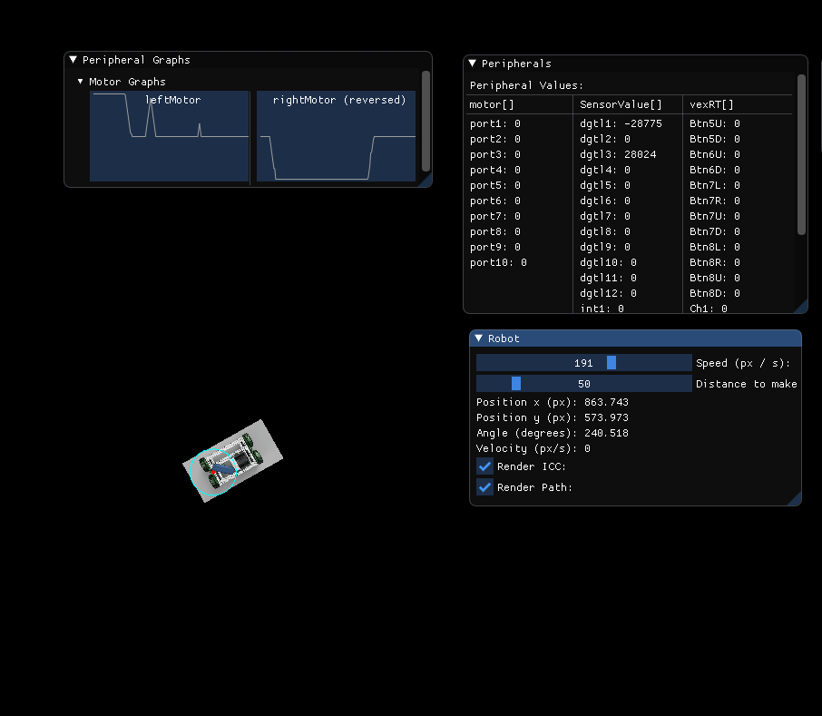

# RobotCSimulator

A basic VEX robot simulator meant for simulating chassis movement.

## Features
This simulator doesn't have that much to it. After converting RobotC code with code some [caveats](https://github.com/Desperationis/RobotCConverter#caveats) using [RobotCConverter](https://github.com/Desperationis/RobotCConverter), this program will allow you to:
* View motor, sensor, and controller values on the fly.
* Show motor and sensor values over time via graphs.
* Use a PS4 controller to provide vexRT[] values.
* Visualize 2D robot movement using [forward differential drive kinematics](http://www.cs.columbia.edu/~allen/F15/NOTES/icckinematics.pdf) to control a virtual robot avatar.
* React to encoder changes based on settings of the robot avatar.
